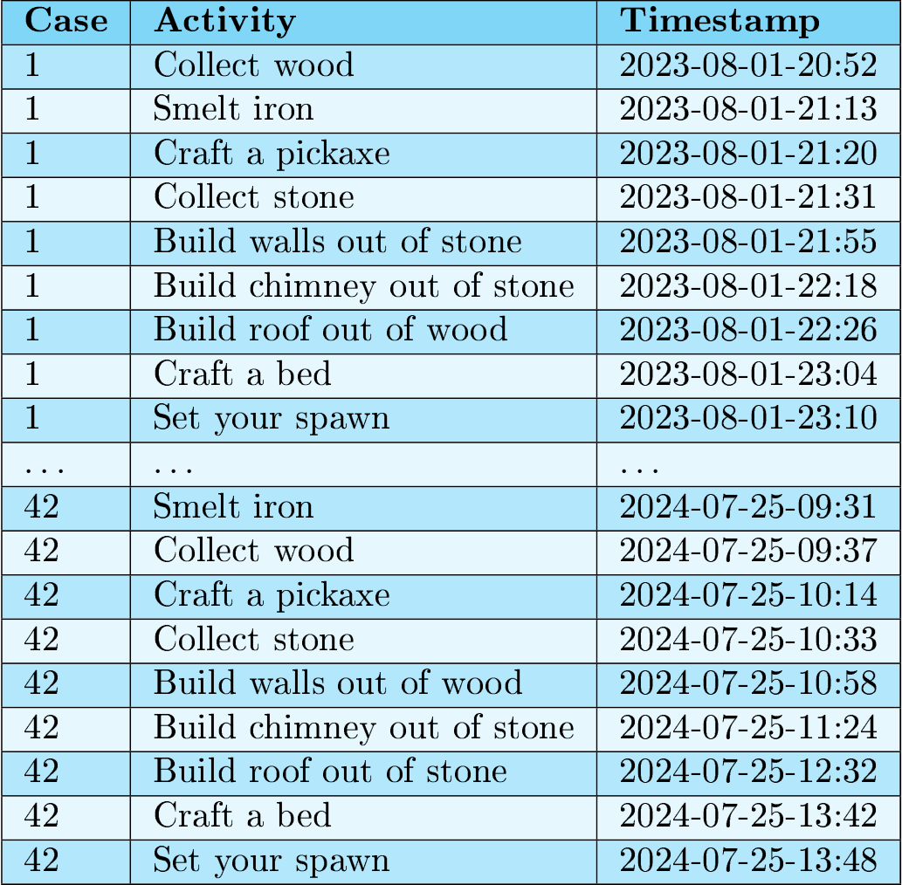
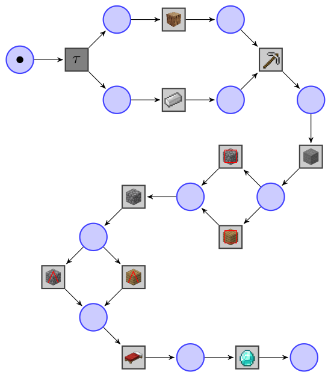
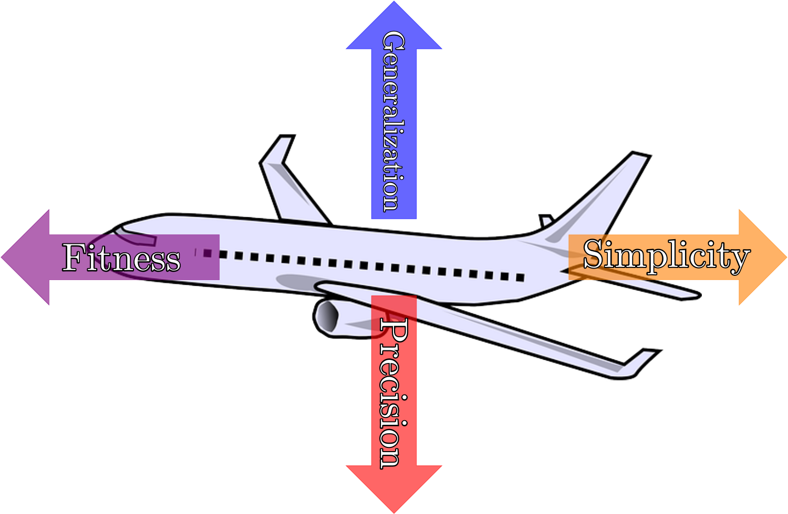
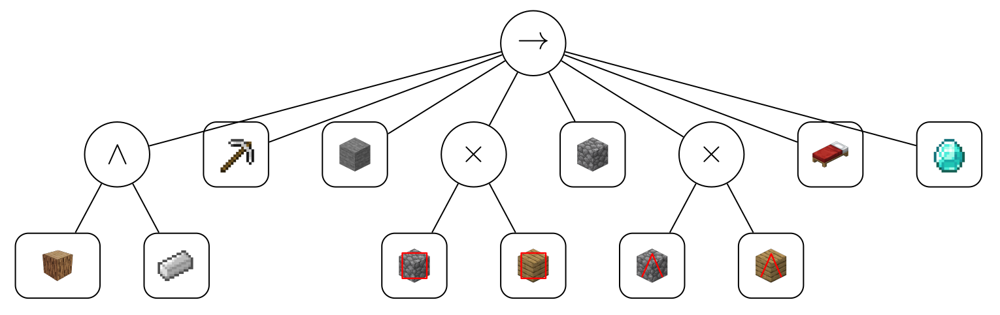

## Navigating Complexity:
## A Tool To Inspect the Impact of Different Complexity Measures to Process Discovery
This repository contains a tool designed to inspect the impact of properties for complexity measures on process discovery algorithms that optimize over the quality criteria. 


### Problem description
_Process discovery_ is a task of _process mining_, whose algorithms take an _event log_ as input and output a model reflecting the behavior of the event log.
As an example, consider the popular video game Minecraft. 
If we record every way in which we built a house in Minecraft, we could end up with the following (very simplified) event log:

<p align="center">
	
</p>

The task of a process discovery algorithm is to find a process model reflecting the behavior in the event log. 
Such a process model can be, for example, a workflow net like in the following Figure:

<p align="center">
	
</p>

To check the quality of a discovered process model, four main quality criteria have been established: fitness, precision, generalization and simplicity.
- *Fitness* evaluates how much of the behavior in the event log is also part of the process model,
- *Precision* quantifies how much more behavior than that of the event log is part of the process model, 
- *Generalization* estimates how much of the process behavior that is not in the event log is part of the process model and 
- *Simplicity* evaluates how simple the process model is.
_Scores_ for this quality dimension are values in the interval [0, 1]. 
The goal of a discovery algorithm is to find a process model with (almost) perfect scores for these quality criteria.
Since some of the quality dimensions contradict each other, this may not be possible and it is desirable to balance the quality scores instead.

<p align="center">
	
</p>

The evolutionary tree miner (ETM) [1] optimizes over these quality criteria by randomly mutating process models and checking whether their quality increases.
Instead of workflow nets, the ETM returns _process trees_ like the one shown in the following Figure:

<p align="center">
	
</p>

The output of the ETM depends on the chosen quality measures to compute fitness, precision, generalization and simplicity. 
If we were to choose a fitness measure that gives all process models the score 1, the ETM would have no way of finding a nicely fitting process model. 
Thus, formal properties of the quality measures are very important for discovery algorithms like the ETM. 
For fitness, precision and generalization, van der Aalst formulates 21 propositions[2] to be able to compare measures and to decide which ones have desirable properties. 
We extended his work by formulating properties for complexity measures[3].
With this tool, we want to investigate how complexity measures with certain properties influence the behavior of the ETM.


### Dependencies
To execute this program, we advise to use `Python 3.8` or higher.

The program in this repository has the following external dependencies: 
- `pm4py v.2.7.11.12` (https://pypi.org/project/pm4py/2.7.11.12/)

After you installed these dependencies, open a terminal in the folder `etm-tool` and execute 
```
python main.py
```

### Overview of the python files
`complexity.py`:
	Contains methods to calculate the complexity of a Petri net.
	At the moment, the only complexity measures implemented are:
	- average connector degree 
	- connector heterogeneity
	- size

`simplicity.py`:
	Contains a class that converts complexity measures into 
	simplicity measures, where the scores range from 0 to 1.
	It does so by using a reference model whose simplicity 
	score is known. At the moment, this calculation is only 
	available for the following complexity measures:
	- average connector degree
	- connector heterogeneity
	- size
	
`quality.py`:
	Contains methods to calculate the quality of a process tree. 
	These methods use the fitness-, precision and generalization-
	calculations provided by the process mining library PM4Py.

`convert.py`:
	Contains method to compose workflow nets and to convert 
	a process tree into a workflow net without removing tau-
	transitions.
	
`utils.py`:
	Contains a method to extract the activities of an event log.

`id_process_tree.py`:
	Contains a class that represents process trees that are equipped 
	with a unique identifier. This avoids that two different nodes 
	with the same label and operator attribute are considered equal. 
	Furthermore, contains methods to randomly create process trees.

`mutations.py`:
	Contains methods to randomly mutate a process tree according to 
	the mutation operations introduced in [1].
	
`etm.py`:
	Contains a simple implementation of the evolutionary tree miner [1], 
	as well as methods to store the evolution of various quality scores.

`main.py`:
	Contains the main function and methods that read user input to 
	specify the parameters for the evolutionary tree miner.
	
## References
[1] J.C.A.M. Buijs, B.F. van Dongen, W.M.P. van der Aalst, _“Quality dimensions in process discovery: the importance of fitness, precision, generalization and simplicity.”_ (2014) in International Journal of Cooperative Information Systems, 23(1), https://doi.org/10.1142/S0218843014400012

[2] W.M.P. van der Aalst, _“Relating process models and event logs - 21 conformance propositions”_ (2018) ATAED@Petri Nets/ACSD https://ceur-ws.org/Vol-2115/ATAED2018-56-74.pdf

[3] P. Schalk, A. Burke, R. Lorenz, _“Navigating Complexity: Comparing Complexity Measures with Weyuker’s Properties”_ (2024) (to be released)
